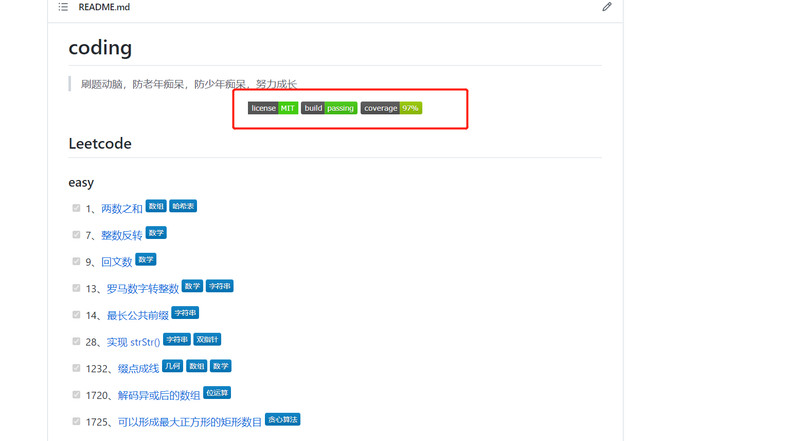

# 基于Typescript和Jest刷题环境搭建与使用

## 写在前面

前几个月在公司用vue3 https://v3.vuejs.org/和ts写项目，想巩固一下基础，于是我想起了去年基于JavaScript和Jest搭建的刷题环境https://zhengjiangtao.cn/coding，不如，给它搞个加强版，结合Typescript和Jest https://jestjs.io/搞一个刷题环境https://zhengjiangtao.cn/coding-ts/，下面是我的一些使用心得，分享给大家。

## 介绍

Typescript是JavaScript的超集https://www.typescriptlang.org/，是前端工程师需要掌握的一门语言。Jest是一个测试框架，具体的可以看我早年写的文章https://www.cnblogs.com/cnroadbridge/p/13524099.html， Babel是一个语言编译器，具体的也可以看我早年写的文章https://www.cnblogs.com/cnroadbridge/p/13311360.html。

## 环境搭建

### 前期工作

这里统一用yarn https://yarnpkg.com/来进行相关的npm 包https://www.npmjs.com/安装与维护，使用其他安装管理工具的参照着这个改吧。

### 创建项目并初始化

```shell
mkdir coding-ts && cd coding-ts
npm init -y
```

### 安装ts的开发环境依赖

```shell
yarn add typescript ts-node @types/node -D
```

### 配置tsconfig.json

```json
{
  "compilerOptions": {
    /* Visit https://aka.ms/tsconfig.json to read more about this file */

    /* Projects */
    // "incremental": true,                              /* Enable incremental compilation */
    // "composite": true,                                /* Enable constraints that allow a TypeScript project to be used with project references. */
    // "tsBuildInfoFile": "./",                          /* Specify the folder for .tsbuildinfo incremental compilation files. */
    // "disableSourceOfProjectReferenceRedirect": true,  /* Disable preferring source files instead of declaration files when referencing composite projects */
    // "disableSolutionSearching": true,                 /* Opt a project out of multi-project reference checking when editing. */
    // "disableReferencedProjectLoad": true,             /* Reduce the number of projects loaded automatically by TypeScript. */

    /* Language and Environment */
    "target": "es2016",                                  /* Set the JavaScript language version for emitted JavaScript and include compatible library declarations. */
    // "lib": [],                                        /* Specify a set of bundled library declaration files that describe the target runtime environment. */
    // "jsx": "preserve",                                /* Specify what JSX code is generated. */
    // "experimentalDecorators": true,                   /* Enable experimental support for TC39 stage 2 draft decorators. */
    // "emitDecoratorMetadata": true,                    /* Emit design-type metadata for decorated declarations in source files. */
    // "jsxFactory": "",                                 /* Specify the JSX factory function used when targeting React JSX emit, e.g. 'React.createElement' or 'h' */
    // "jsxFragmentFactory": "",                         /* Specify the JSX Fragment reference used for fragments when targeting React JSX emit e.g. 'React.Fragment' or 'Fragment'. */
    // "jsxImportSource": "",                            /* Specify module specifier used to import the JSX factory functions when using `jsx: react-jsx*`.` */
    // "reactNamespace": "",                             /* Specify the object invoked for `createElement`. This only applies when targeting `react` JSX emit. */
    // "noLib": true,                                    /* Disable including any library files, including the default lib.d.ts. */
    // "useDefineForClassFields": true,                  /* Emit ECMAScript-standard-compliant class fields. */

    /* Modules */
    "module": "commonjs",                                /* Specify what module code is generated. */
    // "rootDir": "./",                                  /* Specify the root folder within your source files. */
    // "moduleResolution": "node",                       /* Specify how TypeScript looks up a file from a given module specifier. */
    // "baseUrl": "./",                                  /* Specify the base directory to resolve non-relative module names. */
    // "paths": {},                                      /* Specify a set of entries that re-map imports to additional lookup locations. */
    // "rootDirs": [],                                   /* Allow multiple folders to be treated as one when resolving modules. */
    // "typeRoots": [],                                  /* Specify multiple folders that act like `./node_modules/@types`. */
    // "types": [],                                      /* Specify type package names to be included without being referenced in a source file. */
    // "allowUmdGlobalAccess": true,                     /* Allow accessing UMD globals from modules. */
    // "resolveJsonModule": true,                        /* Enable importing .json files */
    // "noResolve": true,                                /* Disallow `import`s, `require`s or `<reference>`s from expanding the number of files TypeScript should add to a project. */

    /* JavaScript Support */
    // "allowJs": true,                                  /* Allow JavaScript files to be a part of your program. Use the `checkJS` option to get errors from these files. */
    // "checkJs": true,                                  /* Enable error reporting in type-checked JavaScript files. */
    // "maxNodeModuleJsDepth": 1,                        /* Specify the maximum folder depth used for checking JavaScript files from `node_modules`. Only applicable with `allowJs`. */

    /* Emit */
    // "declaration": true,                              /* Generate .d.ts files from TypeScript and JavaScript files in your project. */
    // "declarationMap": true,                           /* Create sourcemaps for d.ts files. */
    // "emitDeclarationOnly": true,                      /* Only output d.ts files and not JavaScript files. */
    "sourceMap": true,                                /* Create source map files for emitted JavaScript files. */
    // "outFile": "./",                                  /* Specify a file that bundles all outputs into one JavaScript file. If `declaration` is true, also designates a file that bundles all .d.ts output. */
    "outDir": "dist",                                   /* Specify an output folder for all emitted files. */
    // "removeComments": true,                           /* Disable emitting comments. */
    // "noEmit": true,                                   /* Disable emitting files from a compilation. */
    // "importHelpers": true,                            /* Allow importing helper functions from tslib once per project, instead of including them per-file. */
    // "importsNotUsedAsValues": "remove",               /* Specify emit/checking behavior for imports that are only used for types */
    // "downlevelIteration": true,                       /* Emit more compliant, but verbose and less performant JavaScript for iteration. */
    // "sourceRoot": "",                                 /* Specify the root path for debuggers to find the reference source code. */
    // "mapRoot": "",                                    /* Specify the location where debugger should locate map files instead of generated locations. */
    // "inlineSourceMap": true,                          /* Include sourcemap files inside the emitted JavaScript. */
    // "inlineSources": true,                            /* Include source code in the sourcemaps inside the emitted JavaScript. */
    // "emitBOM": true,                                  /* Emit a UTF-8 Byte Order Mark (BOM) in the beginning of output files. */
    // "newLine": "crlf",                                /* Set the newline character for emitting files. */
    // "stripInternal": true,                            /* Disable emitting declarations that have `@internal` in their JSDoc comments. */
    // "noEmitHelpers": true,                            /* Disable generating custom helper functions like `__extends` in compiled output. */
    // "noEmitOnError": true,                            /* Disable emitting files if any type checking errors are reported. */
    // "preserveConstEnums": true,                       /* Disable erasing `const enum` declarations in generated code. */
    // "declarationDir": "./",                           /* Specify the output directory for generated declaration files. */
    // "preserveValueImports": true,                     /* Preserve unused imported values in the JavaScript output that would otherwise be removed. */

    /* Interop Constraints */
    // "isolatedModules": true,                          /* Ensure that each file can be safely transpiled without relying on other imports. */
    // "allowSyntheticDefaultImports": true,             /* Allow 'import x from y' when a module doesn't have a default export. */
    "esModuleInterop": true,                             /* Emit additional JavaScript to ease support for importing CommonJS modules. This enables `allowSyntheticDefaultImports` for type compatibility. */
    // "preserveSymlinks": true,                         /* Disable resolving symlinks to their realpath. This correlates to the same flag in node. */
    "forceConsistentCasingInFileNames": true,            /* Ensure that casing is correct in imports. */

    /* Type Checking */
    "strict": true,                                      /* Enable all strict type-checking options. */
    // "noImplicitAny": true,                            /* Enable error reporting for expressions and declarations with an implied `any` type.. */
    // "strictNullChecks": true,                         /* When type checking, take into account `null` and `undefined`. */
    // "strictFunctionTypes": true,                      /* When assigning functions, check to ensure parameters and the return values are subtype-compatible. */
    // "strictBindCallApply": true,                      /* Check that the arguments for `bind`, `call`, and `apply` methods match the original function. */
    // "strictPropertyInitialization": true,             /* Check for class properties that are declared but not set in the constructor. */
    // "noImplicitThis": true,                           /* Enable error reporting when `this` is given the type `any`. */
    // "useUnknownInCatchVariables": true,               /* Type catch clause variables as 'unknown' instead of 'any'. */
    // "alwaysStrict": true,                             /* Ensure 'use strict' is always emitted. */
    // "noUnusedLocals": true,                           /* Enable error reporting when a local variables aren't read. */
    // "noUnusedParameters": true,                       /* Raise an error when a function parameter isn't read */
    // "exactOptionalPropertyTypes": true,               /* Interpret optional property types as written, rather than adding 'undefined'. */
    // "noImplicitReturns": true,                        /* Enable error reporting for codepaths that do not explicitly return in a function. */
    // "noFallthroughCasesInSwitch": true,               /* Enable error reporting for fallthrough cases in switch statements. */
    // "noUncheckedIndexedAccess": true,                 /* Include 'undefined' in index signature results */
    // "noImplicitOverride": true,                       /* Ensure overriding members in derived classes are marked with an override modifier. */
    // "noPropertyAccessFromIndexSignature": true,       /* Enforces using indexed accessors for keys declared using an indexed type */
    // "allowUnusedLabels": true,                        /* Disable error reporting for unused labels. */
    // "allowUnreachableCode": true,                     /* Disable error reporting for unreachable code. */

    /* Completeness */
    // "skipDefaultLibCheck": true,                      /* Skip type checking .d.ts files that are included with TypeScript. */
    "skipLibCheck": true                                 /* Skip type checking all .d.ts files. */
  }
}

```

这里也可以用`tsc --init`来初始化, 需要你全局安装typescript这个包

### 安装jest的开发环境依赖

```shell
yarn add jest ts-jest @types/jest -D
```

### 配置jest.config.js

```javascript
/** @type {import('ts-jest/dist/types').InitialOptionsTsJest} */

/*
 * For a detailed explanation regarding each configuration property, visit:
 * https://jestjs.io/docs/en/configuration.html
 */

module.exports = {
  // All imported modules in your tests should be mocked automatically
  // automock: false,

  // Stop running tests after `n` failures
  // bail: 0,

  // The directory where Jest should store its cached dependency information
  // cacheDirectory: "/private/var/folders/6j/_9wqvbk15bl701f7ch11q9p80000gn/T/jest_dx",

  // Automatically clear mock calls and instances between every test
  clearMocks: true,

  // Indicates whether the coverage information should be collected while executing the test
  // collectCoverage: false,

  // An array of glob patterns indicating a set of files for which coverage information should be collected
  // collectCoverageFrom: undefined,

  // The directory where Jest should output its coverage files
  coverageDirectory: 'coverage',

  // An array of regexp pattern strings used to skip coverage collection
  // coveragePathIgnorePatterns: [
  //   "/node_modules/"
  // ],

  // Indicates which provider should be used to instrument code for coverage
  // coverageProvider: "babel",

  // A list of reporter names that Jest uses when writing coverage reports
  // coverageReporters: [
  //   "json",
  //   "text",
  //   "lcov",
  //   "clover"
  // ],

  // An object that configures minimum threshold enforcement for coverage results
  // coverageThreshold: undefined,

  // A path to a custom dependency extractor
  // dependencyExtractor: undefined,

  // Make calling deprecated APIs throw helpful error messages
  // errorOnDeprecated: false,

  // Force coverage collection from ignored files using an array of glob patterns
  // forceCoverageMatch: [],

  // A path to a module which exports an async function that is triggered once before all test suites
  // globalSetup: undefined,

  // A path to a module which exports an async function that is triggered once after all test suites
  // globalTeardown: undefined,

  // A set of global variables that need to be available in all test environments
  // globals: {},

  // The maximum amount of workers used to run your tests. Can be specified as % or a number. E.g. maxWorkers: 10% will use 10% of your CPU amount + 1 as the maximum worker number. maxWorkers: 2 will use a maximum of 2 workers.
  // maxWorkers: "50%",

  // An array of directory names to be searched recursively up from the requiring module's location
  // moduleDirectories: [
  //   "node_modules"
  // ],

  // An array of file extensions your modules use
  // moduleFileExtensions: [
  //   "js",
  //   "json",
  //   "jsx",
  //   "ts",
  //   "tsx",
  //   "node"
  // ],

  // A map from regular expressions to module names or to arrays of module names that allow to stub out resources with a single module
  // moduleNameMapper: {},

  // An array of regexp pattern strings, matched against all module paths before considered 'visible' to the module loader
  // modulePathIgnorePatterns: [],

  // Activates notifications for test results
  // notify: false,

  // An enum that specifies notification mode. Requires { notify: true }
  // notifyMode: "failure-change",

  // A preset that is used as a base for Jest's configuration
  preset: 'ts-jest',

  // Run tests from one or more projects
  // projects: undefined,

  // Use this configuration option to add custom reporters to Jest
  // reporters: undefined,

  // Automatically reset mock state between every test
  // resetMocks: false,

  // Reset the module registry before running each individual test
  // resetModules: false,

  // A path to a custom resolver
  // resolver: undefined,

  // Automatically restore mock state between every test
  // restoreMocks: false,

  // The root directory that Jest should scan for tests and modules within
  // rootDir: undefined,

  // A list of paths to directories that Jest should use to search for files in
  // roots: [
  //   "<rootDir>"
  // ],

  // Allows you to use a custom runner instead of Jest's default test runner
  // runner: "jest-runner",

  // The paths to modules that run some code to configure or set up the testing environment before each test
  // setupFiles: [],

  // A list of paths to modules that run some code to configure or set up the testing framework before each test
  // setupFilesAfterEnv: [],

  // The number of seconds after which a test is considered as slow and reported as such in the results.
  // slowTestThreshold: 5,

  // A list of paths to snapshot serializer modules Jest should use for snapshot testing
  // snapshotSerializers: [],

  // The test environment that will be used for testing
  testEnvironment: 'node',

  // Options that will be passed to the testEnvironment
  // testEnvironmentOptions: {},

  // Adds a location field to test results
  // testLocationInResults: false,

  // The glob patterns Jest uses to detect test files
  // testMatch: [
  //   "**/__tests__/**/*.[jt]s?(x)",
  //   "**/?(*.)+(spec|test).[tj]s?(x)"
  // ],

  // An array of regexp pattern strings that are matched against all test paths, matched tests are skipped
  // testPathIgnorePatterns: [
  //   "/node_modules/"
  // ],

  // The regexp pattern or array of patterns that Jest uses to detect test files
  // testRegex: [],

  // This option allows the use of a custom results processor
  // testResultsProcessor: undefined,

  // This option allows use of a custom test runner
  // testRunner: "jasmine2",

  // This option sets the URL for the jsdom environment. It is reflected in properties such as location.href
  // testURL: "http://localhost",

  // Setting this value to "fake" allows the use of fake timers for functions such as "setTimeout"
  // timers: "real",

  // A map from regular expressions to paths to transformers
  // transform: undefined,

  // An array of regexp pattern strings that are matched against all source file paths, matched files will skip transformation
  // transformIgnorePatterns: [
  //   "/node_modules/",
  //   "\\.pnp\\.[^\\/]+$"
  // ],

  // An array of regexp pattern strings that are matched against all modules before the module loader will automatically return a mock for them
  // unmockedModulePathPatterns: undefined,

  // Indicates whether each individual test should be reported during the run
  // verbose: undefined,

  // An array of regexp patterns that are matched against all source file paths before re-running tests in watch mode
  // watchPathIgnorePatterns: [],

  // Whether to use watchman for file crawling
  // watchman: true,
};

```

### 安装babel的开发环境依赖

```shell
yarn add babel-jest @babel/core @babel/preset-env @babel/preset-typescript -D
```

### 配置babel.config.js

```javascript
module.exports = {
  presets: [
    ['@babel/preset-env', { targets: { node: 'current' } }],
    '@babel/preset-typescript',
  ],
};
```

具体的参考这里，https://jestjs.io/docs/getting-started

### 安装prettier 和 eslint的开发环境依赖

```shell
yarn add prettier onchange eslint-config-prettier eslint-plugin-prettier -D
```

### 配置.prettierrc和.prettierignore

`.prettierrc`

```json
{
  "semi": true,
  "tabWidth": 2,
  "printWidth": 120,
  "endOfLine": "lf",
  "singleQuote": true,
  "trailingComma": "es5",
  "bracketSpacing": true,
  "alwaysParens": "always",
  "eslintIntegration": true,
  "jsxSingleQuote": true
}
```

`.prettierignore`

```
# Ignore artifacts:
coverage
# ignore dependency folder
node_modules/
```

### 配置.eslintrc

```javascript
{
  "root": true,
  "parser": "@typescript-eslint/parser",
  "plugins": [
    "@typescript-eslint",
    "prettier"
  ],
  "extends": [
    "eslint:recommended",
    "plugin:@typescript-eslint/eslint-recommended",
    "plugin:@typescript-eslint/recommended",
    "prettier"
  ],
  "rules": {
    "no-console": 1,       // Means warning
    "prettier/prettier": 2 // Means error
  }
}
```

具体的可以参考这里，https://khalilstemmler.com/blogs/tooling/prettier/

### 配置package.json的相关script

```json
 "scripts": {
    "build": "tsc",
    "test": "jest",
    "test:help": "jest --help",
    "test:debug": "jest --debug",
    "test:verbose": "jest --verbose",
    "test:init": "jest --init",
    "test:json": "jest --json",
    "test:exportJson": "jest --json --outputFile=./export/reporter.json",
    "test:coverage": "jest --coverage",
    "test:watchAll": "jest --watchAll",
    "pretty": "prettier --config .prettierrc \"code/**/*.ts\" --write",
    "pretty-watch": "onchange \"code/**/*.ts\" -- prettier --write {{changed}}",
    "git:pull": "pull",
    "git:push": "push"
  }
```

## 测试案例

这里以两数之和为例，做一个简单的代码测试，具体的如下：

源码

```typescript
// code/sum.ts 两数之和测试案例
type sumType = (a: number, b: number) => number;
const sum: sumType = (a, b) => a + b;
export default sum;
```

测试代码

```typescript
// test/sum.test.ts
import sum from '../code/sum';

test('1 + 2 = 3', () => {
  let x: number = 1, y: number = 2;
  let expected: number = 3;

  let res: number = sum(x, y);

  expect(res).toBe(expected);
});
```

在项目文件下执行`yarn test` 我们查看下运行的效果

```shell
PS D:\ataola\github\ataola\coding-ts> yarn test
yarn run v1.22.11
$ jest
 PASS  test/sum.test.ts (8.801 s)
  √ 1 + 2 = 3 (2 ms)

Test Suites: 1 passed, 1 total
Tests:       1 passed, 1 total
Snapshots:   0 total
Time:        10.721 s
Ran all test suites.
Done in 26.79s.
PS D:\ataola\github\ataola\coding-ts> 
```

## 持续集成和代码覆盖率

Travis可以对项目做一个持续集成 https://app.travis-ci.com/github/ataola/coding-ts，结合Codecov，https://app.codecov.io/gh/ataola/coding-ts可以对代码覆盖率做一个测试，这样项目看上去就丰满了很多



关于Travis和Codecov的相关实践，具体的可以参见https://www.cnblogs.com/cnroadbridge/p/14716361.html

## 写在后面

项目地址： https://github.com/ataola/coding-ts

线上访问地址: https://zhengjiangtao.cn/coding-ts/

感谢阅读！

